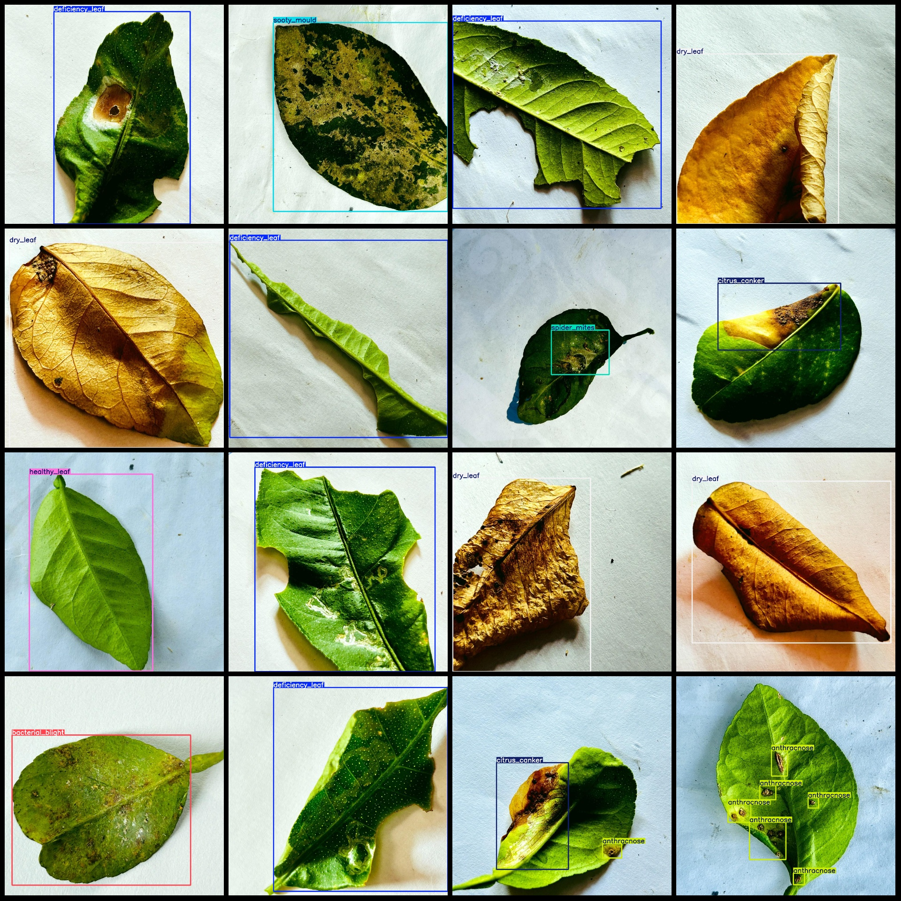
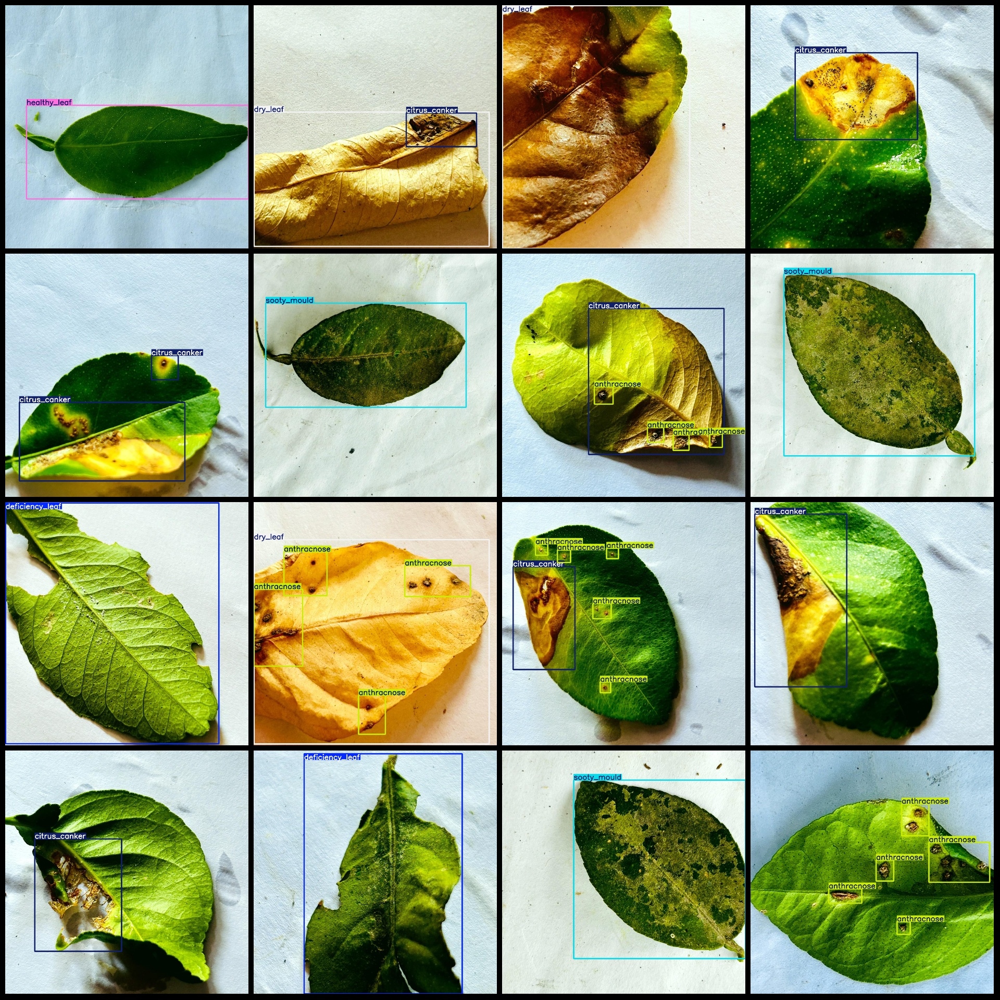

# Citrus Leaves Disease Detection Dataset VOC+YOLO-format 1352 Category 9

The dataset is in Pascal VOC format and YOLO format. The txt file does not contain the split path, only contains the jpg images and corresponding VOC xml files and YOLO txt files.
number of images: 1352  
The number of XML files is 1352.
The number of txt files is 1352.
annotationnumber of classes: 9  
Annotation class names: ["anthracnose", "bacterial_blight", "citrus_canker", "curl_virus", "deficiency_leaf", "dry_leaf", "healthy_leaf", "sooty_mould", "spider_mites"]
boxes per class:   
The anthracnose (anthrax) disease box count is 959.
Bacterial blight is a disease of plants that affects various crops, including potatoes, carrots, and tomatoes. It is caused by the bacterium Xanthomonas campestris pv. vesicatoria, which produces a toxin called phytoene that inhibits plant growth and causes wilting and death.

The severity of bacterial blight can vary depending on the crop and the environmental conditions. In some cases, it can cause significant yield losses, especially in fields with poor drainage or high humidity. The disease can also affect crops grown under glasshouses or greenhouses, where the lack of air circulation can create an environment conducive to the growth of the bacteria.

To control bacterial blight, farmers often use resistant varieties of crops, such as potatoes that are naturally resistant to the disease. They may also use fungicides or biological control methods, such as introducing natural predators of the bacteria, to prevent or treat the disease. In addition, proper irrigation and soil management can help reduce the incidence of bacterial blight in crops.
Citrus canker (Chlorotic ringspot of citrus) box count = 205
Curled virus (leaf curling virus) box count = 125
Deficiency leaf (deficient leaves) box count = 193
Dry leaf (dry leaves) box count = 183
Healthy leaf (healthy leaves) box count = 209
Sooty mould (black spot) box count = 153
Spider mites (spider mites/nematodes) box count = 116
total boxes: 2252  
images per class:   
Anthracnose: Images = 288
Bacterial Blight: Images = 105
Citrus Canker: Images = 194
Curl Virus: Images = 125
The number of deficiency_leaf images = 193.
Dry leaf images are 183.
The number of images for "healthy_leaf" is 209.
Sooty mould (Coal stain) has 153 pictures.
The spider mites (red spider mites/leaf miners) images = 116
image resolution: 1000x1000  
Using annotation tool: labelImg
Annotation rule: Draw a rectangle around the class
Important notes: The dataset does not have a training/validation/test split. You need to manually split it.
Special statement: This dataset does not guarantee any accuracy for models or weights files trained on it.
Image preview:
## Images

Here is a pay link on Stripe ( https://buy.stripe.com/3cs8yP7sY87d0vu9AB ). Please contact me lonlonago@foxmail.com after funding $89, and I will send you a complete data files , thank you!

